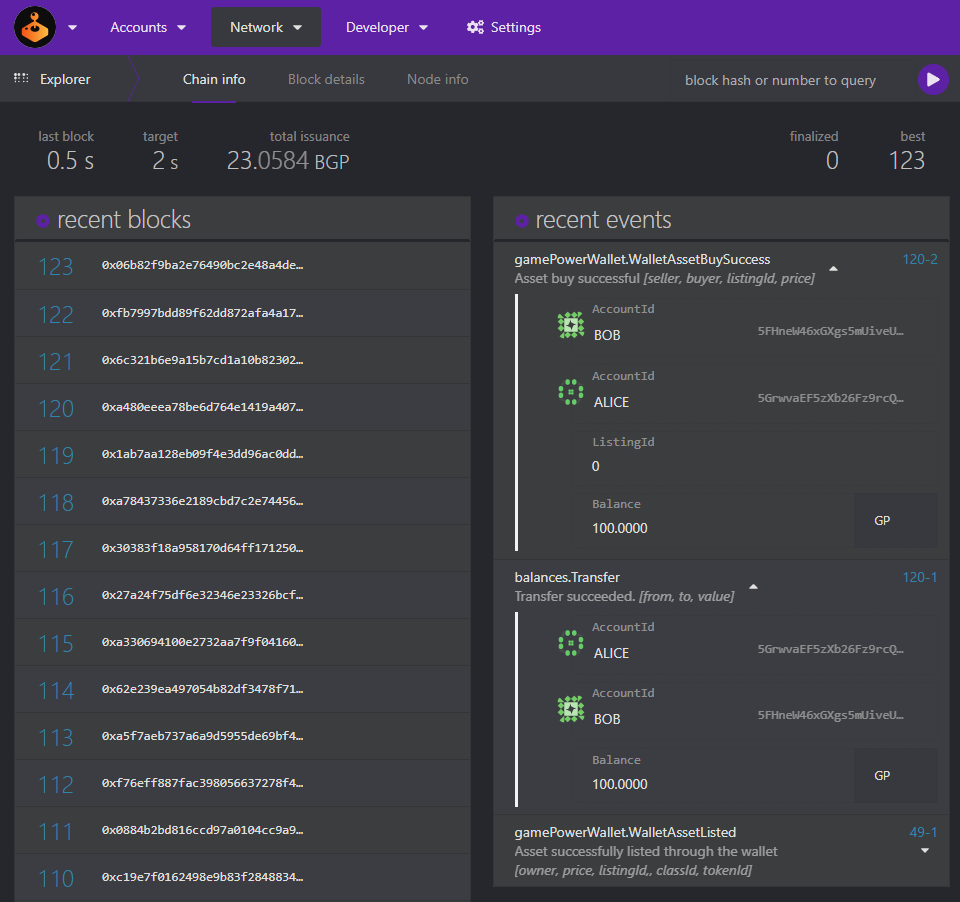

## Run in Docker
---
First, install [Docker](https://docs.docker.com/get-docker/) and
[Docker Compose](https://docs.docker.com/compose/install/).

Then run the following command to build the docker image.

```bash
docker build -t gamepower-wallet:0.0.1 .
```

Next you can run the image in a container using the following command

```bash
docker run -p 9944:9944 gamepower-wallet:0.0.1
```

## Interacting on Polkadot.js.org
---
You can access your local running docker container here: [Polkadot.js Local Node](https://polkadot.js.org/apps/?rpc=ws%3A%2F%2F127.0.0.1%3A9944)

### STEP 0
>Before we begin, there are some types that need to be added to the polkadot.js app. You can enter these types under `Settings -> Developer`

```
{
  "ListingId": "u64",
  "ClaimId": "u128",
  "Asset": {
    "ClassIdOf": "ClassIdOf",
    "TokenIdOf": "TokenIdOf"
  },
  "ListingOf": "Listing",
  "Listing": {
    "id": "ListingId",
    "owner": "AccountId",
    "asset": "Asset",
    "price": "Balance"
  },
  "OrderOf": "Order",
  "Order": {
    "listing": "ListingOf",
    "buyer": "AccountId",
    "block": "BlockNumber"
  },
  "ClaimOf": "Claim",
  "Claim": {
    "receiver": "AccountId",
    "asset": "Asset"
  },
  "WalletClassData": {
    "metadata": "Vec<u8>"
  },
  "WalletAssetData": {
    "metadata": "Vec<u8>"
  },
  "TokenInfo": {
    "metadata": "Vec<u8>",
    "owner": "AccountId",
    "data": "WalletAssetData"
  },
  "ClassInfo": {
    "metadata": "Vec<u8>",
    "total_issuance": "TokenId",
    "owner": "AccountId",
    "data": "WalletClassData"
  }
}
```
### STEP 1
Once here, visit `Developer -> Extrinsics` tab. Here you can select `Bob` as your selected account

Select the `gamePowerWalletIntegration` module and the `createClass` method as shown below.

You must have at least 1 asset class and token available to perform this test. Enter the data and submit the transaction.
<p align="center">
  
</p>

### STEP 2
Select the `mint` method and add any meta data or properties that you like, set the quantity. Then submit the transaction.

Enter the id of the class we create 0 and token id we just created which is 0..(quantity minted). Finally set a price for this asset on the market and submit the transaction.
<p align="center">
  
</p>


### STEP 3
Now let's actually do something cool. Select the `gamePowerWallet` module and the `list` method as shown below. We will use this to sell the NFT on the market.
<p align="center">
  
</p>

### STEP 4
If you go to the `Network -> Explorer` tab you will see our listing event under `recent events`. Here you can also see the ListingId which is 0. Let's use this.
<p align="center">
  
</p>

You can also go to `Developer -> Chain state` tab and you will see under `gamePowerWallet` storage that we have a listing with the supplied data. Leave the ListingId field blank to see all of the listings in storage.
<p align="center">
  
</p>

Let's use that ListingId back on the `Extrinsics` view to allow `Alice` to buy the asset listed. Select the `buy` method under `gamePowerWallet` module to provide the ListingId of 0 and then submit the transaction.
<p align="center">
  
</p>

### STEP 5
Now we can go back to `Network -> Explorer` tab and see under `recent events` that our purchase was successful and the balance was transferred to the seller.

<p align="center">
  
</p>

Now we can go back to `Developer -> Chain state` tab and see that our buy order was recorded under `orderHistory`.

<p align="center">
  
</p>
